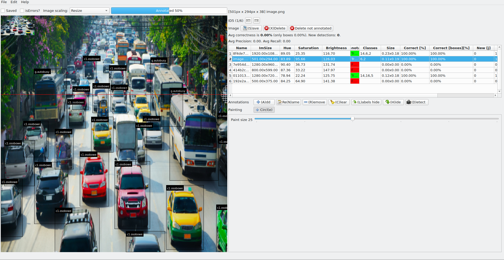

# YAYA - Yet Another YOLO Annoter


`YAYA - Yet Another YOLO Annoter` with `QT5 widgets` gui, and ...

- Rewritten in **python**,
- Checks for errors of **overriding boxes**,
- Displays **image properties** `size`, `hue`, `saturation`, `brightness`,
- Displays **annotations properties**, `average size`, `class numbers`,
- Uses given **YOLOv4 detectors** to detect every file and store detections!
- Calculate **metrics TP,TN,FP,FN,Precision,Recall** for every photo!
- Auto-annotation with **YOLOv4 detectors** feature added  - use yolo to detect and describe annotations of your image,
- Manual Yolo detection by presing 'd' - to check YOLO with original data,
- You can use standard YOLOv4 (MSCOCO) or your custom YOLOv4

### Requirements

`pip install -r requirements`

Install YOLOv4 darknet library  `libdarknet.so` in your operating system (https://github.com/AlexeyAB/darknet) for usage of custom YOLOv4 detectors.


### How to add custom YOLOv4 detector?

1. Inside directory `ObjectDetectors/` create your detector directory (for example `yolov4custom`).
2. Copy all YOLOv4 detector files  : `yolo.cfg`,  `yolo.data`,  `yolo.names`,  `yolo.weights` (names should be identicall)
3. Got it! Now you can use this detector!

Found detectors list is also shown at the program start, example :

```
python ./yolo-annotate.py -i input/
DEBUG:root:Logging enabled!
/usr/local/lib/libdarknet.so
INFO:root:(Found detector) 0 - /home/spasz/python/aisp-tools/yaya/ObjectDetectors/yolov4custom/yolo.
```


### How to start?

To load all test images from `input` directory and start application, you can use command

`./yolo-annotate.py -i input/`

### Key codes

```shell
LPM - create annotation
d - run detector
r - remove annotation
c - clear all annotations
s - save all (if errors not exists)
arrow -> or . - next image
arrow <- or , - previous image
```
### Command line

```shell
usage: yolo-annotate.py [-h] -i INPUT [-c CONFIG] [-on] [-yc] [-v]

optional arguments:
  -h, --help       show this help message and exit
  -i INPUT, --input INPUT
             Input path
  -c CONFIG, --config CONFIG
             Config path
  -on, --onlyNewFiles  Process only files without detections file.
  -yc, --yoloCustom   Use custom YOLO.
  -v, --verbose     Show verbose finded and processed data
```

------------

# [!DEPRECATED!] yolo-annotate - old OpenCV version.


**[!DEPRECATED! - Use `release/v0.6-OpenCV` for old OpenCV version]** **Yet Another yolo annotation program**. Yolo_mark clone with openCV gui, but ...

- Rewritten in python,
- Checks for errors of overriding boxes,
- Auto-annotation feature added  - use yolo to detect and describe annotations of your image,
- Manual Yolo detection by presing 'd' - to check YOLO with original data,
- You can use standard YOLOv4 (MSCOCO) or your custom YOLOv4
